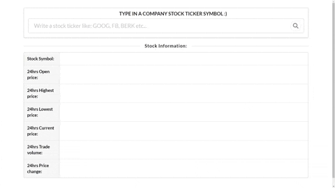

                                                  PERSONAL PROJECT 

My goal was to create an application using React (focusing on Props/State/API Request) where the user can type in a stock ticker symbol and get the company quote in return from an external API (in this case I used AlphaVantage free API). For the UI prototyping I decided to go with Semantic UI framework, so I could easily create the containers and start working on the logic. 

In the end I found a new React Component called NumberFormat, I used in order to format the API price response into a better looking variable, adding prefix, sufix and thousand separator. 

Follow bellow a simple GIF showing the application:

